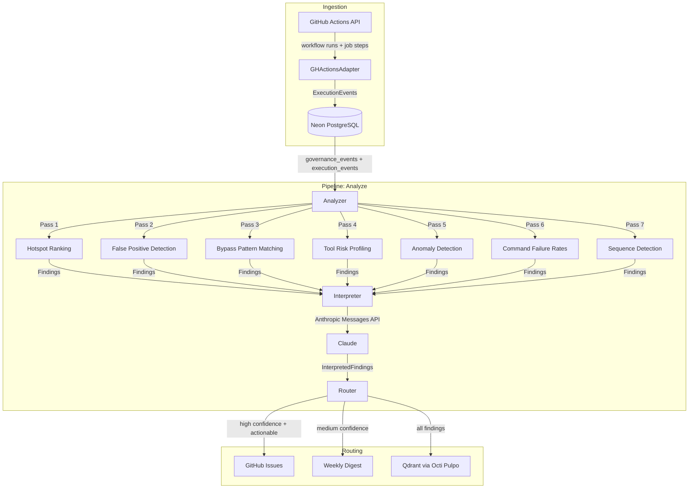

# Sentinel

Telemetry engine for the Chitin governance platform. Ingests GitHub Actions execution logs into Neon (PostgreSQL), runs 7 detection passes for anomalies and drift, enriches findings with LLM interpretation, and routes actionable results as GitHub issues.

## Architecture



## Getting Started

### Prerequisites

- Go 1.24+
- Neon PostgreSQL database (set `NEON_DATABASE_URL`)
- GitHub token (set `GITHUB_TOKEN`) for Actions log ingestion
- Anthropic API key (set `ANTHROPIC_API_KEY`) for LLM interpretation (optional -- runs in passthrough mode without it)

### Install

```bash
git clone https://github.com/chitinhq/sentinel.git
cd sentinel
go build -o sentinel ./cmd/sentinel/
```

### Database Setup

Run the migration to create the `execution_events` table:

```bash
psql "$NEON_DATABASE_URL" -f migrations/001_execution_events.sql
```

### Configuration

Edit `sentinel.yaml` to configure detection thresholds, ingestion repos, and routing:

```yaml
ingestion:
  github_actions:
    repos:
      - chitinhq/chitin
      - chitinhq/sentinel
    since: 168h

detection:
  false_positive:
    min_sample_size: 20
    deviation_threshold: 2.0
  bypass:
    window: 5m
  anomaly:
    volume_spike_threshold: 3.0

routing:
  high_confidence: 0.8
  medium_confidence: 0.5
  dedup_similarity: 0.85
```

### Quick Start

```bash
# Ingest execution events from GitHub Actions
export NEON_DATABASE_URL="postgres://..."
export GITHUB_TOKEN="ghp_..."
sentinel ingest

# Run all 7 detection passes, interpret findings, route to GitHub/digest
export ANTHROPIC_API_KEY="sk-ant-..."
sentinel analyze

# Generate a weekly markdown digest
sentinel digest
```

## CLI Commands

| Command | Description |
|---------|-------------|
| `sentinel ingest` | Fetch GitHub Actions workflow runs and persist as execution events |
| `sentinel analyze` | Run 7 detection passes, LLM interpretation, and route findings |
| `sentinel digest` | Generate a markdown digest of findings with Slack notification |

There is also a `sentinel-mcp` binary that exposes Sentinel as an MCP tool server for integration with AI coding agents.

## Detection Passes

| Pass | Name | What It Detects |
|------|------|-----------------|
| 1 | Hotspot | Most-used actions ranked by volume |
| 2 | False Positive | Policies with denial rates deviating from baseline |
| 3 | Bypass | Deny-retry-allow sequences within a time window |
| 4 | Tool Risk | Actions with high denial-to-total ratios |
| 5 | Anomaly | Volume spikes and sessions with excessive denials |
| 6 | Command Failure | Commands with high failure rates across repos |
| 7 | Sequence | Recurring n-gram patterns in failing sessions |

## Development

```bash
go build ./...
go test ./...
golangci-lint run
```

Set `SENTINEL_CONFIG` to point to a custom config path (defaults to `sentinel.yaml` in the working directory). Set `SENTINEL_DIGEST_DIR` to control where digest markdown files are written.

## License

MIT
